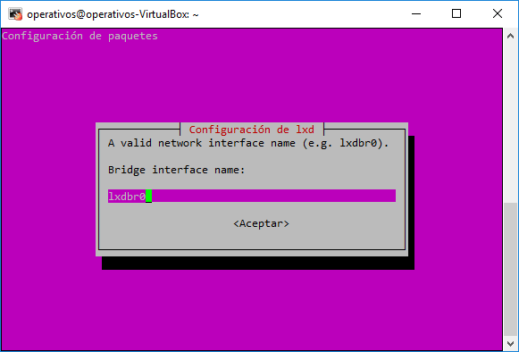
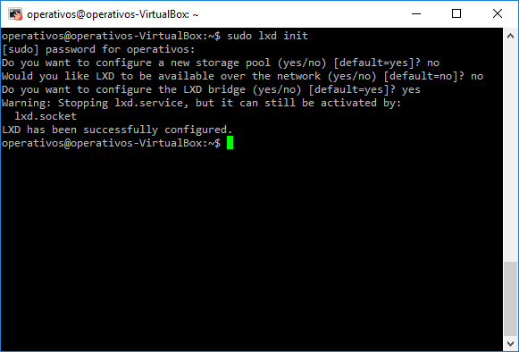

## Miniproyecto Sistemas Operativos

**Universidad ICESI**  
**Curso:** Sistemas Operativos  
**Docente:** Daniel Barragán C.  
**Tema:**  LXC/LXD Containers  
**Correo:** daniel.barragan at correo.icesi.edu.co

**Código:** AXXXXXXXXX  
**Nombre:** Juan Camilo Villada

**Código:** AXXXXXXXXX  
**Nombre:** Ándres Felipe Pérez

**Código:** A00054000  
**Nombre:** Jonatan Ordoñez Burbano

**Repositorio GitHub:** https://github.com/JonatanOrdonez/so-project/tree/so-project

## Aproviosionamiento básico de máquina virtual: instalación de sistema operativo, configuración de interfaces de red, minimo 4 núcleos
* Para instalar Ubuntu 16.04, creamos una nueva máquina virtual utilizando VirtualBox. Para ello, ejecutamos la aplicación y presionamos en el botón azul 'Nueva'. En el cuadro emergente le asignamos un nombre a nuestra máquina, en este caso nuestra máquina virtual se va a llamar ubuntu y presionamos en la opción 'Next'.


* Luego le asignamos aproximadamente 2GB de memoria RAM a nuestra máquina virtual y presionamos en 'Next'.


* Lo siguiente que hacemos es crear un espacio virtual para el disco duro de nuestra máquina, para ello seleccionamos la opción 'Crear un disco duro virtual ahora' y luego presionamos en 'Next'.


* En la siguiente ventana seleccionamos la opción 'Reservado dinamicamente' para que nuestro espacio virtual de disco duro crezca según su uso. Luego presionamos en 'Next'.


* En la siguiente pantalla le asignamos un espacio mínimo de capacidad de disco duro virtual a nuestra máquina. En este caso dejamos el valor por defecto que son 10GB. Finalmente presionamos en la opción 'Crear'.


* En la siguiente imagen podemos ver que nuestra máquina virtual se ha creado exitosamente. Ahora vamos a configurar nuestra interfaz de red seleccionando nuestra máquina y presionando en la opción 'Configuración'.


* En el siguiente panel emergente vamos a la opción 'Red' y en la pestaña de 'Adaptador 2', habilitamos el adaptador de red. Después, en la opción 'Conectado a', seleccionamos aquella que dice 'Adaptador puente'. Finalmente seleccionamos la interfaz provistas por el computador y en nuestro caso seleccionaremos la interfaz inalambrica.


* Finalmente, aceptamos la configuración y procedemos a ejecutar la máquina virtual. En el siguiente cuadro emergente indicamos la ruta donde se encuentra la ISO con S.O y presionamos en la opción 'Iniciar'.


* Como se puede ver en la siguiente imagen, debemos seleccionar el idioma de instalación de Ubuntu. Selecionaremos la opción 'Español' y luego en 'Instalar ahora'.


* En la siguiente pantalla seleccionamos ambas opciones para instalar las actualizaciones de ubuntu y softwares de terceros para la compatibilidad del audio y video de nuestro computador. Luego presionamos en la opción 'Continuar'.


* Debido a que se trata de una instalación limpia, selecionaremos la opción 'Borrar disco e instalar ubuntu' como se muestra en la siguiente imagen. Luego presionamos en 'Instalar ahora'.


* En la siguiente ventana vamos a selecionar la ciudad donde nos encontremos, en nuestro caso vamos a escribir 'Bogota' y continuaremos con nuestra instalación.


* A continuación, vamos a seleccionar la disposición de teclado. Por defecto, ubuntu detecta nuestra configuración que es 'Español (latinoamericano)'. Después de esto selecionamos la opción 'Continuar'.


* En la siguiente pantalla vamos a crear un usuario para nuestro S.O. Vamos a indicarle que el nombre de la máquina sea 'operativos' al igual que el nombre de isuario y la contraseña.


* Dejaremos que la instalación empiece y una vez finalice nos aparecerá un cuadro indicandonos que deberemos reiniciar la máquina. Después de reiniciar la máquina virtual iniciaremos sesión con nuestro usuario creado en el paso anterior.


## Instalación de LXC/LXD con permisos para el usuario operativos
* Después de completar la instalación del sistema operativo ubuntu, vamos a ejecutar el siguiente comando para instalar el hypervisor LXD, el cual es un administrador de contenedores de linux y que sirve de complemento para LXC, añadiendo más funcionalidades y facilitando el uso de contenedores a través de comandos simples.

```Console
$ sudo apt install lxd lxd-client
```

* Además, es necesario instalar el paquete de bridge-utils que contiene una utilidad necesaria para crear y administrar dispositivos puente, lo cual es útil para configurar redes para una máquina virtual. Para instalar este paquete utilizaremos el siguiente comando.

```Console
$ sudo apt-get install bridge-utils
```

* La última instalación que realizaremos para administrar nuestros contenedores es la de zfsutils-linux. Este paquete permite la creación y administración de sistemas de archivos OpenZFS mediante los comandos zfs y zpool. Para instalar este paquete utilizaremos el siguiente comando.

```Console
$ sudo apt-get install zfsutils-linux
```

### ¿Qué es un storage pool?
Un storage pool es la agrupación de varios discos SSD en un entorno de almacenamiento compartido, logrando que el sistema operativo vea todos estos disco como un solo disco grande. Cada disco que agregamos a un storage pool se particiona en cuatro segmentos y cada segmento de cada disco se agrupa con una partición de los otros discos creando un Raid Group, finalmente cada Raid Group recibe como nombre Allocation Unit.

### ¿Qué es ZFS y cuáles son sus ventajas?
ZFS es un sistema de ficheros de archivos de código abierto creado por Sun Microsystem y en un principio fue diseñado para el sistema operativo Solaris. Este sistema de ficheros fue provisto con sistemas contra perdida y corrupción de datos, logrando proteger la información del sistema. En resumen, ZFS provee una manera para gestionar el contenido que se almacena en disco en un formato propio.

Entre las principales características que ofrece ZFS se encuentran:
 * Integridad de datos comparable: Esta característica permite que los archivos se mantengan correctamente, siendo capaz de detectar datos o archivos corruptos y arreglarlos automaticamente, esto se logra a través de un modelo transaccional.

  * Modelo transaccional: Un modelo transaccional consiste en el almacenamiento de eventos o transacciones. Es decir que, cuando un se modifican archivos en el disco duro, estos no son sobreescritos de forma automática sino que se crea un nuevo espacio donde estos datos son grabados y luego se modifican los apuntadores del archivo original para que hagan referencia al nuevo fichero.

  * Snapshots: Son copias del sistema de archivo de fácil creación, permitiendo hacer respaldo de la información o copias de seguridad de forma casi inmediata, con la caracteristica de que son sólo de lectura.

  * Clones: Al igual que los Snapshots, son copias de respaldo del sistema de información, pero estas se puede hacer escritura.

* Continuando con nuestra instalación, vamos a configurar un puente, por medio del cual, los contenedores se van a comunicar con el host y luego con internet. Para ello vamos a ejecutar el siguiente comando.

```Console
$ sudo lxd init
```

* Al utilizar el comando anterior, realizaremos algunas configuraciones básicas para poder administrar nuestros contenedores. Después de pasar algunas configuraciones, llegaremos a la siguiente opción: Do you want to configure the LXD bridge (yes/no)? En nuestro shell escribiremos yes y se desplegara una interfaz donde configuraremos nuestro bridge. A continuación dos capturas que muestran estas opciones.


* Después de entrar en esta interfaz, vamos a indicarle un nombre a la nueva interfaz puente; por cuestiones prácticas le vamos a poner 'bridge' y aceptamos para pasar a la siguiente pantalla.



* En la siguiente pantalla, el sistema nos preguntara si deseamos configurar la conectividad por IPv4, le daremos que 'Sí'.


* Luego, debemos indicar una dirección IPv4 y en este caso utilizaremos la ip '192.168.2.0'.


* A continuación, debemos indicarle que tipo de mascara de red vamos a utilizar, en nuestro caso dejaremos la que aparece por defecto que es de 24 bits.


* En el siguiente cuadro vamos a indicarle la primera dirección IP que se usará en nuestra lista de direcciones (DHCP). Utilizaremos la ip '192.168.2.0' que es la misma que aparece en el paso de arriba.


* Lo siguiente que haremos es indicar cual será la última dirección IP de nuestro pool de direcciones. Asignaremos la dirección '192.168.2.254'


* En la siguiente pantalla deberemos indicar cual es el máximo número de clientes DHCP, en nuestro caso dejaremos el valor por defecto que es 252.


* En el cuadro siguiente, el sistema nos pregunta si queremos intercambiar paquetes entre dos redes que asignan direcciones incompatibles entre ellas (NAT), selecionaremos la opción 'Si'.


* Finalmente, podemos observar en la siguiente captura que la configuración fue exitosa.



## Bibliografía
* https://community.netapp.com/t5/Espa%C3%B1a/Storage-Pools/ba-p/99752
* https://www.redeszone.net/2016/10/01/zfs-las-caracteristicas-este-sistema-archivos-avanzado/