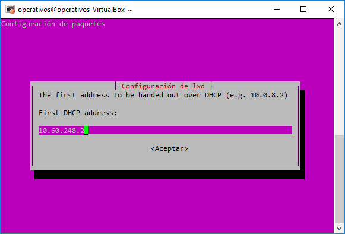
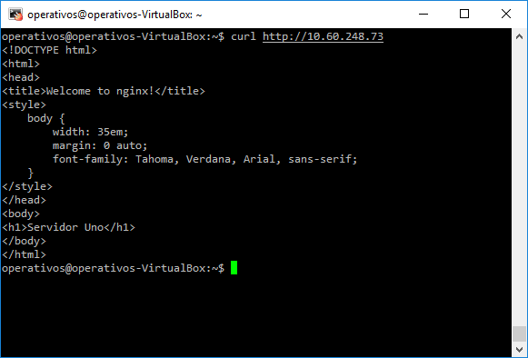
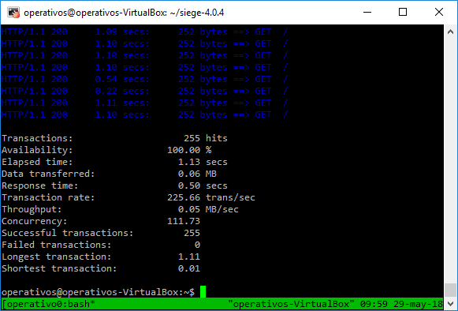

## Miniproyecto Sistemas Operativos

**Universidad ICESI**  
**Curso:** Sistemas Operativos  
**Docente:** Daniel Barragán C.  
**Tema:**  LXC/LXD Containers  
**Correo:** daniel.barragan at correo.icesi.edu.co

**Código:** A00320192  
**Nombre:** Juan Camilo Villada

**Código:** AXXXXXXXXX  
**Nombre:** Ándres Felipe Pérez

**Código:** A00054000  
**Nombre:** Jonatan Ordoñez Burbano

**Repositorio GitHub:** https://github.com/JonatanOrdonez/so-project/tree/so-project

## Aproviosionamiento básico de máquina virtual: instalación de sistema operativo, configuración de interfaces de red, minimo 4 núcleos
* Para instalar Ubuntu 16.04, creamos una nueva máquina virtual utilizando VirtualBox. Para ello, ejecutamos la aplicación y presionamos en el botón azul 'Nueva'. En el cuadro emergente le asignamos un nombre a nuestra máquina, en este caso nuestra máquina virtual se va a llamar ubuntu y presionamos en la opción 'Next'.


* Luego le asignamos aproximadamente 2GB de memoria RAM a nuestra máquina virtual y presionamos en 'Next'.


* Lo siguiente que hacemos es crear un espacio virtual para el disco duro de nuestra máquina, para ello seleccionamos la opción 'Crear un disco duro virtual ahora' y luego presionamos en 'Next'.


* En la siguiente ventana seleccionamos la opción 'Reservado dinamicamente' para que nuestro espacio virtual de disco duro crezca según su uso. Luego presionamos en 'Next'.


* En la siguiente pantalla le asignamos un espacio mínimo de capacidad de disco duro virtual a nuestra máquina. En este caso dejamos el valor por defecto que son 10GB. Finalmente presionamos en la opción 'Crear'.


* En la siguiente imagen podemos ver que nuestra máquina virtual se ha creado exitosamente. Ahora vamos a configurar nuestra interfaz de red seleccionando nuestra máquina y presionando en la opción 'Configuración'.


* En el siguiente panel emergente vamos a la opción 'Red' y en la pestaña de 'Adaptador 2', habilitamos el adaptador de red. Después, en la opción 'Conectado a', seleccionamos aquella que dice 'Adaptador puente'. Finalmente seleccionamos la interfaz provistas por el computador y en nuestro caso seleccionaremos la interfaz inalambrica.


* Finalmente, aceptamos la configuración y procedemos a ejecutar la máquina virtual. En el siguiente cuadro emergente indicamos la ruta donde se encuentra la ISO con S.O y presionamos en la opción 'Iniciar'.


* Como se puede ver en la siguiente imagen, debemos seleccionar el idioma de instalación de Ubuntu. Selecionaremos la opción 'Español' y luego en 'Instalar ahora'.


* En la siguiente pantalla seleccionamos ambas opciones para instalar las actualizaciones de ubuntu y softwares de terceros para la compatibilidad del audio y video de nuestro computador. Luego presionamos en la opción 'Continuar'.


* Debido a que se trata de una instalación limpia, selecionaremos la opción 'Borrar disco e instalar ubuntu' como se muestra en la siguiente imagen. Luego presionamos en 'Instalar ahora'.


* En la siguiente ventana vamos a selecionar la ciudad donde nos encontremos, en nuestro caso vamos a escribir 'Bogota' y continuaremos con nuestra instalación.


* A continuación, vamos a seleccionar la disposición de teclado. Por defecto, ubuntu detecta nuestra configuración que es 'Español (latinoamericano)'. Después de esto selecionamos la opción 'Continuar'.


* En la siguiente pantalla vamos a crear un usuario para nuestro S.O. Vamos a indicarle que el nombre de la máquina sea 'operativos' al igual que el nombre de isuario y la contraseña.


* Dejaremos que la instalación empiece y una vez finalice nos aparecerá un cuadro indicandonos que deberemos reiniciar la máquina. Después de reiniciar la máquina virtual iniciaremos sesión con nuestro usuario creado en el paso anterior.


## Instalación de LXC/LXD con permisos para el usuario operativos
* Después de completar la instalación del sistema operativo ubuntu, vamos a ejecutar el siguiente comando para instalar el hypervisor LXD, el cual es un administrador de contenedores de linux y que sirve de complemento para LXC, añadiendo más funcionalidades y facilitando el uso de contenedores a través de comandos simples.

```Console
$ sudo apt install lxd lxd-client
```

* Además, es necesario instalar el paquete de bridge-utils que contiene una utilidad necesaria para crear y administrar interfaces bridge, lo cual es útil para configurar redes para una máquina virtual. Para instalar este paquete utilizaremos el siguiente comando.

```Console
$ sudo apt-get install bridge-utils
```

* La última instalación que realizaremos para administrar nuestros contenedores es la de zfsutils-linux. Este paquete permite la creación y administración de sistemas de archivos OpenZFS mediante los comandos zfs y zpool. Para instalar este paquete utilizaremos el siguiente comando.

```Console
$ sudo apt-get install zfsutils-linux
```

### ¿Qué es un storage pool?
Un storage pool es la agrupación de varios discos SSD en un entorno de almacenamiento compartido, logrando que el sistema operativo vea todos estos disco como un solo disco grande. Cada disco que agregamos a un storage pool se particiona en cuatro segmentos y cada segmento de cada disco se agrupa con una partición de los otros discos creando un Raid Group, finalmente cada Raid Group recibe como nombre Allocation Unit.

### ¿Qué es ZFS y cuáles son sus ventajas?
ZFS es un sistema de ficheros de archivos de código abierto creado por Sun Microsystem y en un principio fue diseñado para el sistema operativo Solaris. Este sistema de ficheros fue provisto con sistemas contra perdida y corrupción de datos, logrando proteger la información del sistema. En resumen, ZFS provee una manera para gestionar el contenido que se almacena en disco en un formato propio.

Entre las principales características que ofrece ZFS se encuentran:
 * Integridad de datos comparable: Esta característica permite que los archivos se mantengan correctamente, siendo capaz de detectar datos o archivos corruptos y arreglarlos automaticamente, esto se logra a través de un modelo transaccional.

  * Modelo transaccional: Un modelo transaccional consiste en el almacenamiento de eventos o transacciones. Es decir que, cuando un se modifican archivos en el disco duro, estos no son sobreescritos de forma automática sino que se crea un nuevo espacio donde estos datos son grabados y luego se modifican los apuntadores del archivo original para que hagan referencia al nuevo fichero.

  * Snapshots: Son copias del sistema de archivo de fácil creación, permitiendo hacer respaldo de la información o copias de seguridad de forma casi inmediata, con la caracteristica de que son sólo de lectura.

  * Clones: Al igual que los Snapshots, son copias de respaldo del sistema de información, pero estas se puede hacer escritura.

* Continuando con nuestra instalación, vamos a configurar un puente, por medio del cual, los contenedores se van a comunicar con el host y luego con internet. Para ello vamos a ejecutar el siguiente comando.

```Console
$ sudo lxd init
```

* Al utilizar el comando anterior, realizaremos algunas configuraciones básicas para poder administrar nuestros contenedores. Después de pasar algunas configuraciones, llegaremos a la siguiente opción: Do you want to configure the LXD bridge (yes/no)? En nuestro shell escribiremos yes y se desplegara una interfaz donde configuraremos nuestro bridge. A continuación dos capturas que muestran estas opciones.


* Después de entrar en esta interfaz, vamos a indicarle un nombre a la nueva interfaz puente; por cuestiones prácticas dejamos el valor por defecto y aceptamos para pasar a la siguiente pantalla.


* En la siguiente pantalla, el sistema nos preguntara si deseamos configurar la conectividad por IPv4, le daremos que 'Sí'.


* Luego, debemos indicar una dirección IPv4 y en este dejaremos el valor que aparece indicado en pantalla.


* A continuación, debemos indicarle que tipo de mascara de red vamos a utilizar, en nuestro caso dejaremos la que aparece por defecto que es de 24 bits.


* En el siguiente cuadro vamos a indicarle la primera dirección IP que se usará en nuestra lista de direcciones (DHCP). Dejamos el mismo valor que aparece por defecto y presionamos en 'Aceptar'.



* Lo siguiente que haremos es indicar cual será la última dirección IP de nuestro pool de direcciones. Dejaremos el valor que aparece por defecto.


* En la siguiente pantalla deberemos indicar cual es el máximo número de clientes DHCP, en nuestro caso dejaremos el valor por defecto que es 252.


* En el cuadro siguiente, el sistema nos pregunta si queremos intercambiar paquetes entre dos redes que asignan direcciones incompatibles entre ellas (NAT), selecionaremos la opción 'Si'.


* Finalmente, podemos observar en la siguiente captura que la configuración fue exitosa.


## Creación de contenedores con servicio web (tenga en cuenta que son dos contenedores web)
* El primer comando que ejcutaremos para crear nuestro primer contenedor web es el siguiente.

```Console
$ lxc launch ubuntu:16.04 webserver1
```

* Debido a que nunca se habían creado contenedores en nuestra máquina virtual, el comando anterior descarga una imágen de ubuntu 16.04 y la almacena en disco para que pueda ser utilizada como plantilla para otros contenedores. 

* Repetiremos el comando anterior para 'webserver2' y para 'loadbalancer' y ya tendremos 3 contenedores. A continuación, se puede ver la lista de contenedores creados mediante el comando 'lxc list'.


* En la imagen anterior, podemos observar que la asignación de IPs se realiza de forma automática a partir de la configuración de la interfaz bridge creada en los pasos anteriores. Además, los contenedores se encuentran activos. 

* Lo siguiente que haremos es alojar un sitio web utilizando nginx en los contenedores 'webserver1' y 'webserver2', para ello entramos al shell de webserver1 utilizando el siguiente comando.

```Console
$ lxc exec webserver1 -- /bin/bash
```

* Dentro del shell del contenedor webserver1, ejecutaremos el comando que se mostrará a continuación, el cual permite instalar un servidor web/proxy llamado nginx.

```Console
$ sudo apt-get install nginx
```

* Después de terminarse la instalación del servidor, iremos a la carpeta /var/www/html/ y editaremos el archivo index que se encuentra adentro. Esto lo podemos hacer con el siguiente comando.

```Console
$ sudo vi /var/www/html/index.nginx-debian.html
```

* El comando anterior nos muestra el siguiente contenido, el cual va a ser la página principal que podra ser vista cuando se acceda al servidor.


* Para diferenciar este contenido del servidor dos, modificaremos el archivo dejandolo de la siguiente forma.


* Lo siguiente que haremos es ejecutar el siguiente comando para verificar el estado del servidor nginx.

```Console
$ sudo service nginx status
```

* En la siguiente captura podemos observar que el servidor se encuentra funcionando correctamente.


* Lo siguiente que haremos es salirnos del shell del contendor webserver1 utilizando el comando 'exit' y vamos a hacerle una petición CURL a la ip donde se encuentra el contenedor que es la '10.60.248.73'. En la siguiente imagen se ve el resultado de hacer la petición y efectivamente el servidor se encuentra funcionado.



* Realizamos el mismo procedimiento para el 'webserver2' y este es el resultado final de hacerle curl a ambos servidores.


* Ya para acabar la configuración de los servidores web, vamos a asignarles un procesador único a cada uno. Para ello utilizaremos el siguiente comando.

```Console
$ lxc config set webserver1 limits.cpu 1
```

* Ejecutaremos este mismo comando pero para el 'webserver2' quedando de la siguiente manera.

```Console
$ lxc config set webserver2 limits.cpu 1
```

## Creación de contenedor con servicio de balanceo de carga
* Para crear el balanceador de carga en el contenedor 'loadbalancer' ingresamos a su shell e instalamos nginx.

* Después de instalar el servidor, vamos a crear un archivo llamado 'load-balancer.conf' en la carpeta /etc/nginx/conf.d/. Esto lo haremos con el siguiente comando.

```Console
$ sudo vi /etc/nginx/conf.d/load-balancer.conf
```

* Se creará un archivo vacío y adentro ingresaremos el siguiente contenido.

```Console
# Define which servers to include in the load balancing scheme. 
# It's best to use the servers' private IPs for better performance and security.
# You can find the private IPs at your UpCloud Control Panel Network section.

upstream backend {
   least_conn;
   server 10.60.248.73; 
   server 10.60.248.86;
}

# This server accepts all traffic to port 80 and passes it to the upstream. 
# Notice that the upstream name and the proxy_pass need to match.

server {
   listen 80; 

   location / {
      proxy_pass http://backend;
   }
}
```

* El archivo anterior contiene dos servidores que corresponden a los contenedores 'webserver1' y 'webserver2'. Para identificarlos agregamos las IPs de ambos contenedores. Para balancear la carga entre ambos servidores utilizaremos el método 'least connection', el cual dirige las solicitudes al servidor con las conexiones menos activas en ese momento.

* Guardamos el archivo y ejecutamos el siguiente comando para eliminar la carpeta por defecto para alojar sitios web. Esto lo hacemos para que las peticiones no accedan al sitio web sino que pasen por el balanceador de carga.

```Console
$ sudo rm /etc/nginx/sites-enabled/default
```

* Finalmente, reiniciaremos el servicio nginx mediante el siguiente comando y nuestro balanceador de carga funcionará correctamente.

```Console
$ sudo service nginx restart
```

* En la siguiente imagen podemos ver en la parte izquierda que el servidor donde se encuentra almacenado nuestro balanceador de carga se encuentra activo; en cambio, en la parte derecha se hacen dos peticiones CURL a la IP del balanceador de carga y la primera respuesta apunta al servidor uno mientras que la segunda petición da como resultado el servidor dos.


* Para permitir conexiones remotas a nuestro balanceador de carga, utilizaremos el siguiente comando que crea una regla en la iptable, la cual permite que el tráfico http del host sea reenviado al contenedor del balanceador de carga.

```Console
sudo iptables -t nat -A PREROUTING -p tcp -m conntrack --ctstate NEW --dport 80 -j DNAT --to-destination 10.60.248.59:80
```

* Para verificar que podemos acceder a nuestros servidores pero pasando por el balanceador de carga, vamos al navegador y escribiremos la ip de la máquina virtual que es '192.168.1.10'. Cada vez que recarguemos la página se cambiara el servidor al que estemos accediendo.


* Podemos verificar en la siguiente captura que nuestros contenedores se encuentran activos y la interfaz de red tipo bridge se encuentra también activa.


## Pruebas del funcionamiento del balanceador
* Lo primero que haremos para ejecutar las pruebas de estrés hacia nuestros servidores web es instalar siege. Siege es una utilidad de pruebas de carga http utilizado para medir el rendimiento de servidores web. Para instalarlo, ejecutaremos el siguiente comando para descargar la última versión disponible en el sitio web de siege.

```Console
wget http://download.joedog.org/siege/siege-latest.tar.gz
```

* Luego vamos a extraer el contenido del archivo con el siguiente comando.

```Console
tar -zxvf siege-latest.tar.gz
```

* Lo siguiente que haremos es instalar un compilardor de C++ ya que en la instalación de siege va a ser necesario. Esto lo haremos mediante el siguiente comando.

```Console
sudo apt-get install build-essential
```

* Para finalizar la instalación ejecutaremos los siguiente comandos.

```Console
./configure
```

```Console
make
```

```Console
sudo make install
```

* En este punto, siege ya habrá quedado instalado en nuestra máquina virtual.

### Pruebas de estrés servidores web con uso de CPU al 50%
* Para modificar el porcentaje de CPU utilizado por los servidores web a 50%, vamos a ejecutar los siguientes comandos.

```Console
lxc config set webserver1 limits.cpu.allowance 50%
```

```Console
lxc config set webserver2 limits.cpu.allowance 50%
```

* Ahora, utilizando nuestra herramienta de test siege ejecutaremos el siguiente comando, el cual asigna una concurrencia de 255 usuarios y ejecuta las pruebas una sola vez.

```Console
siege -c 255 10.60.248.59 --reps=1
```

* En el comando anterior indicamos la IP de nuestro balanceador de carga para que apunte a dicho contenedor.

* A continuación, se muestra el resultado de las pruebas.


### Pruebas de estrés servidores web con uso de CPU al 100%
* Para habilitar el uso de cpu de los servidores al 100%, ejecutaremos los siguientes comandos.

```Console
lxc config set webserver1 limits.cpu.allowance 100%
```

```Console
lxc config set webserver2 limits.cpu.allowance 100%
```

* Ahora volveremos a ejeutar el mismo comando de siege para ejecutar las pruebas de estrés. El resultado de las pruebas es el siguiente.


* Podemos observar que se reduce que la concurrencia y el throughput con el resultado anterior disminuye 

### Pruebas de estrés servidores web con 64MB de memoria RAM
* Para limitar el uso de memoria RAM de los contenedores web a 64MB, ejecutaremos los siguientes comandos.

```Console
lxc config set webserver1 limits.memory 64MB
```

```Console
lxc config set webserver2 limits.memory 64MB
```

* Luego, usando el mismo comando para pruebas de estrés, ejecutaremos las mismas pruebas usando la utilidad siege. A continuación, se muestra el resultado de las pruebas.



### Pruebas de estrés servidores web con 128MB de memoria RAM
* Ejecutamos los siguientes comando para modificar el límte de memoria RAM utilizada por ambos servidores web a 128MB.

```Console
lxc config set webserver1 limits.memory 128MB
```

```Console
lxc config set webserver2 limits.memory 128MB
```

* Volvemos a ejecutar las pruebas de estrés y obtenemos los siguientes resultados.


* Realizando la comparación, podemos observar que al aumentar la cantidad de memoria RAM disponible por ambos servidores web, podemos reducir la concurrencia y el throughtput, además de la tasa de transacciones.

* A continuación, se vuelve a presentar una captura con la respuesta del balanceador de carga al hacerle dos peticiones mediante el comando CURL.


## Bibliografía
* https://community.netapp.com/t5/Espa%C3%B1a/Storage-Pools/ba-p/99752
* https://www.redeszone.net/2016/10/01/zfs-las-caracteristicas-este-sistema-archivos-avanzado/
* https://www.upcloud.com/support/how-to-set-up-load-balancing/
